# Hi, I'm Ajay Sawle 👋

### Aspiring Full-Stack Developer | React · Next.js · TypeScript

I’m a first-year student at Dyal Singh College, University of Delhi, passionate about building modern web applications and learning through real-world projects.

- Currently working on **Medicare**
- Exploring full-stack development and modern web technologies
- Interested in clean UI, problem-solving, and building useful products
- Former professional BGMI player

---

## 🧰 Tech Stack

  

## 🚀 Featured Project

### 🏥 Medicare — Healthcare Information Platform

A project in development focused on healthcare information, disease and symptom knowledge, and finding nearby doctors.

<!-- Replace YOUR-MEDICARE-REPO with your repository name -->
[View Medicare](https://github.com/INDxSnipzY/Medicare)

---

## 📊 GitHub Stats

  
  

---

## 🤝 Connect With Me

  
  
  <!-- Add your LinkedIn and portfolio links here -->

---

<i>Building, learning, and improving — one project at a time.</i>

  
